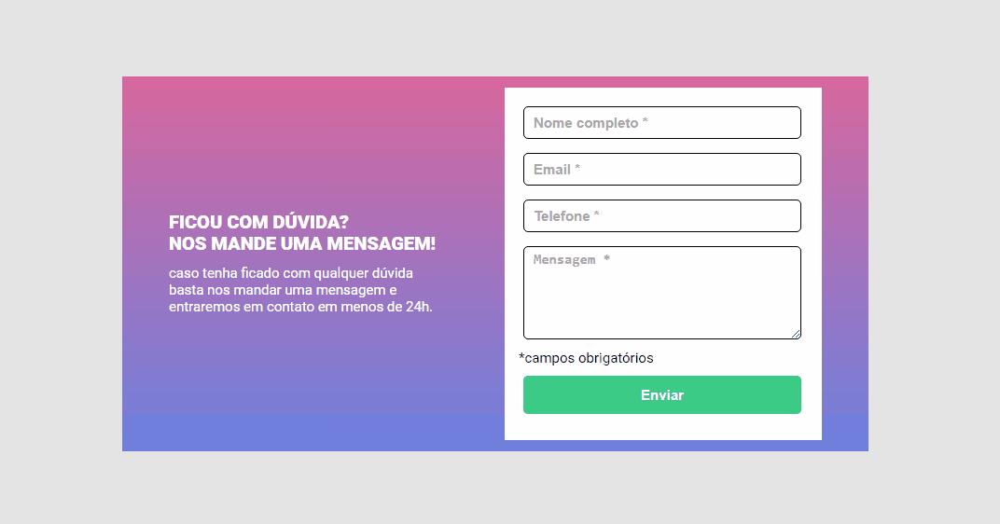

# Desafio DevQuest Formulário com validação - HTML, CSS e JS Intermediário

[](https://www.figma.com/design/zBKnYG9UNdUiIr8ClQTWSG/DESAFIO---HTML%2FCSS%2FJS-INTERMEDI%C3%81RIO?node-id=3-2&t=hEpKSfDkcjcqkntq-0)

## Tecnologias utilizadas

<div style="display: inline_block"><br>


</div>


## Meu Processo

### Feito com

- Marcação/tags do HTML5
- Propriedades/atributos do CSS
- Posicionamento dos elementos usando Flexbox
- Validação de formulário e manipulação de DOM com JavaScript

## Como utilizar

1 - Clone

```
https://github.com/hamilton-vivas/desafioQuest-validacaoFormulario.git
```

2 - Acesse a pasta do projeto

```
desafioQuest-validacaoFormulario
```

### Desafios enfrentados

- **Validação de formulário:** Implementar a validação dos campos do formulário usando JavaScript foi um desafio interessante. Garantir que as mensagens de erro aparecessem corretamente e que as bordas dos inputs mudassem de cor conforme o preenchimento exigiu um entendimento aprofundado de eventos e manipulação de DOM.
  
- **Estilização:** Manter a consistência do design da página com Flexbox foi outro desafio. Foi necessário ajustar cuidadosamente o CSS para garantir que os elementos fossem exibidos corretamente na tela.

- **Integração de fontes externas:** Integrar fontes externas do Google Fonts, também foi um ponto a considerar.

- **Gestão de classes CSS dinâmicas:** Manipular classes CSS dinamicamente através do JavaScript para refletir corretamente o estado dos inputs (vazio e preenchido) envolveu um planejamento cuidadoso e testes para assegurar que a experiência do usuário fosse intuitiva e sem problemas.

- **Desafio simples, mas proveitoso:** Este projeto foi simples, mas muito proveitoso, pois abrangeu vários conceitos juntos, como HTML, CSS e JavaScript. A integração desses conceitos permitiu um aprendizado mais completo e a aplicação prática de diversas habilidades adquiridas.

- Cada um desses desafios contribuiu para a nossa curva de aprendizado e melhoria contínua nas práticas de desenvolvimento front-end.

## Autor

- Portifólio - [Hamilton Alexandre](https://hamilton-vivas.github.io/portfolio-simplificado/)

## Agradecimentos

Agradeço ao Curso [DevQuest](https://devemdobro.com/devquest-starter/), os gêmeos e sua equipe, pela oportunidade de poder programar em "grande estilo" e com a "mágica" do Js, no ambiente de desevolvimento Frontend, onde foi possível chegar até aqui.
